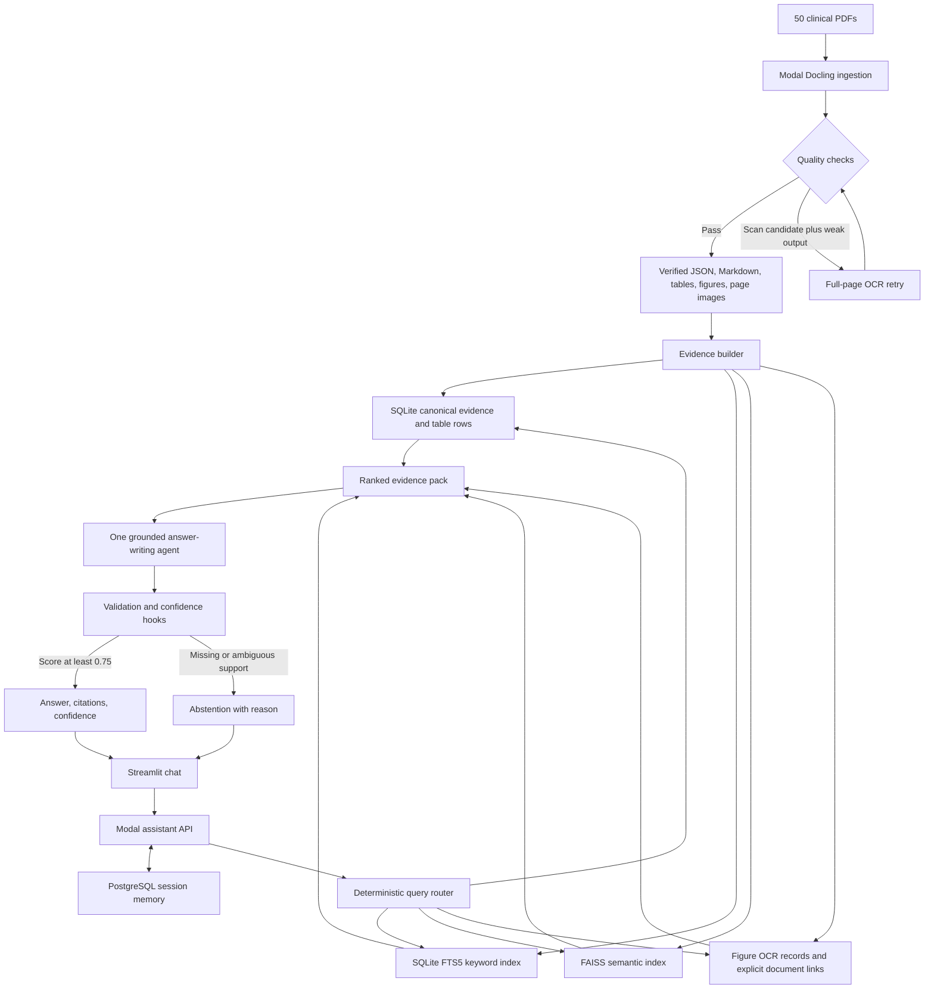

# MediAssist

MediAssist is a closed-corpus clinical question-answering prototype built over 50 fixed PDF monographs. It retrieves text, tables, figures, scanned appendices, and explicit links between documents; writes an answer only from retrieved evidence; returns page-level citations; and abstains when the evidence is missing or ambiguous.

> This is an interview prototype over a supplied document collection. It is not medical advice and is not intended to process real patient data.

## Live demo

**[Open the MediAssist clinical document assistant](https://mediassist-kmyjtfkkufdqwsskjwmewg.streamlit.app/)**

Ask a question, inspect the cited document pages, and start a new conversation from the sidebar. Multi-turn context is stored by user and session in PostgreSQL, but previous chat messages are treated only as conversational context—not as medical evidence.

## What the system must handle

The corpus is deliberately difficult: native PDF text, scanned pages, multi-column layouts, rotated pages, dense and landscape tables, footnotes, figures containing numeric values, and questions whose evidence spans multiple PDFs. The system therefore has four requirements:

1. Preserve the document's structure during ingestion instead of flattening every page into plain text.
2. Retrieve by meaning, exact wording, structured fields, figures, and explicit document links.
3. Preserve provenance so every factual claim can be traced to a document, page, section, and Docling source reference.
4. Refuse to guess when retrieval, OCR, table structure, or cross-document evidence is incomplete.

## End-to-end architecture




The design is hybrid RAG with explicit structured relations, not a general-purpose knowledge graph. A full knowledge graph would add entity extraction and relation-maintenance complexity that the fixed corpus does not require. Explicit cross-document instructions are represented as hard links in SQLite; broader similarity between documents remains available through semantic and keyword retrieval.

## Why hybrid retrieval

No single retrieval method covers the corpus:


| Evidence need                  | Best retrieval path                             | Why                                                                             |
| ------------------------------ | ----------------------------------------------- | ------------------------------------------------------------------------------- |
| Explanatory prose              | Semantic search + keyword search                | Meaning and exact clinical terms both matter.                                   |
| Codes and registry identifiers | Metadata/SQLite + FTS5                          | Exact strings should not depend on embedding similarity.                        |
| Dose or landscape-table values | Structured table rows                           | The row-to-column relationship must be preserved.                               |
| Figure values                  | Figure record + precomputed OCR                 | Figure captions, nearby text, OCR, and visual-risk flags are separate evidence. |
| Scanned appendices             | OCR-derived text/table evidence                 | The answer may not exist in the PDF text layer.                                 |
| Cross-document questions       | Explicit reference traversal + target retrieval | The answer must cite both the source instruction and target value.              |
| Corpus-wide lists              | Deterministic SQL aggregation                   | Top-k search cannot prove that a list is complete.                              |


Semantic and keyword results are fused with reciprocal-rank fusion. Structured evidence receives small priority bonuses because exact rows, metadata, figures, and explicit links are more reliable for their matching intents.

## Retrieval depth and top-k policy

The initial controller always requests up to 12 semantic and 12 keyword candidates. Intent-specific lookups are then added when required. Semantic search first examines a larger candidate pool—`max(10 × top_k, 50)`—so a document filter does not remove all candidates after the FAISS search.

All retrieved records are merged by evidence ID using reciprocal-rank fusion with `k = 60`. The controller sends the top 12 fused evidence items to the answer-writing agent. The agent may make at most three bounded follow-up tool calls; a follow-up hybrid search returns at most six items and a structured-table lookup returns at most eight rows.

This is intentionally small enough to keep the prompt focused while still allowing semantic, lexical, and exact evidence to agree. Corpus-wide questions bypass top-k completeness problems by using deterministic aggregation.

## Knowledge-base build

The verified build used by the evaluation contains:


| Record                       | Count   |
| ---------------------------- | ------- |
| Documents                    | 50      |
| Searchable evidence chunks   | 972     |
| Text/footnote chunks         | 788     |
| Table chunks                 | 121     |
| Figure chunks                | 13      |
| Explicit reference chunks    | 50      |
| Canonical tables             | 111     |
| Structured table rows        | 362     |
| Resolved document references | 50 / 50 |
| Processing errors            | 0       |


All 50 submitted PDFs passed the ingestion checks and selected the standard Docling pipeline. A pass means the prototype's structural checks passed; it does not prove that every OCR token or visual relationship is correct.

## Evaluation results

The supplied evaluation set contains questions but no gold answers. The results below therefore describe **answer coverage and abstention behavior, not factual accuracy**.

- 40/40 backend calls completed.
- 27 questions received grounded answers.
- 13 questions were abstained.
- Observed answer coverage was 67.5%.


| Question group              | Total | Answered | Abstained | Observed behavior                                                   |
| --------------------------- | ----- | -------- | --------- | ------------------------------------------------------------------- |
| General text                | 8     | 8        | 0         | Semantic + keyword retrieval worked well.                           |
| Classification codes        | 5     | 5        | 0         | Exact metadata/table retrieval worked.                              |
| Review-body footnotes       | 4     | 0        | 4         | Approval footnotes were not resolved into usable evidence.          |
| Figure numeric values       | 4     | 0        | 4         | OCR found tokens but not an unambiguous value-to-year relationship. |
| Scanned appendices          | 4     | 4        | 0         | OCR-derived appendix evidence was retrieved.                        |
| Landscape tables            | 3     | 3        | 0         | Structured row lookup preserved headers and values.                 |
| Cross-document doses        | 6     | 5        | 1         | Five explicit link chains completed; one remained incomplete.       |
| Corpus-wide aggregation     | 2     | 2        | 0         | Deterministic SQL aggregation avoided incomplete top-k lists.       |
| General/possible abstention | 3     | 0        | 3         | The corpus did not provide sufficiently reliable support.           |
| Reverse registry lookup     | 1     | 0        | 1         | Requested registry metadata was not found reliably.                 |


The readable answers are in `[agent_answers.md](agent_answers.md)`. The complete response objects, retrieval traces, confidence components, and build identifiers are in `[backend_responses.jsonl](backend_responses.jsonl)`. The supplied questions are in `[Medical_PDF/candidate_questions.md](Medical_PDF/candidate_questions.md)`.

## Confidence and abstention

The language model never assigns its own confidence. Deterministic code computes a transparent evidence-reliability score:

```text
raw confidence =
    0.30 × required-fact coverage
  + 0.20 × retrieval support
  + 0.20 × extraction quality
  + 0.20 × grounding validation
  + 0.10 × evidence consistency
```

The components mean:

- **Coverage:** whether every fact required by the detected intent is supported.
- **Retrieval support:** fused rank strength, agreement between retrieval channels, and named-document matching.
- **Extraction quality:** the weakest cited evidence quality, with lower values for OCR/visually uncertain evidence.
- **Grounding:** citation validity, claim-to-citation coverage, and exact numeric support.
- **Consistency:** whether the evidence chain is internally complete, especially for cross-document questions.

Deterministic caps prevent a plausible average from hiding a critical failure:


| Condition                                                      | Effect                        |
| -------------------------------------------------------------- | ----------------------------- |
| Output validation fails                                        | Confidence becomes 0.00.      |
| Critical evidence needs visual review                          | Confidence is capped at 0.60. |
| All cited evidence is figure OCR                               | Confidence is capped at 0.80. |
| Cross-document chain lacks two documents or the reference edge | Confidence becomes 0.00.      |
| Any required fact is unsupported                               | Confidence is capped at 0.60. |
| Prototype otherwise scores above 0.95                          | Confidence is capped at 0.95. |


The assistant answers only when the final score is at least **0.75**. Scores at or above **0.85** are labelled high; scores from **0.75 to 0.8499** are medium; anything below **0.75** produces an abstention. These values are heuristic and not statistically calibrated because the assignment does not provide labelled answers. A production calibration would require a manually verified gold set and reliability analysis over held-out questions.

## Technology choices


| Layer                   | Technology                | Role                                                                            |
| ----------------------- | ------------------------- | ------------------------------------------------------------------------------- |
| Document parsing        | Docling                   | Layout-aware PDF parsing, OCR, tables, JSON, Markdown, and image assets.        |
| Cloud execution/storage | Modal                     | Remote ingestion, evidence building, assistant serving, and persistent volumes. |
| Text chunking           | Docling HybridChunker     | Token-aware chunks that retain headings and document structure.                 |
| Semantic retrieval      | all-MiniLM-L6-v2 + FAISS  | Fast local 384-dimensional cosine search.                                       |
| Keyword retrieval       | SQLite FTS5               | Exact-term and BM25-style lexical matching.                                     |
| Structured retrieval    | SQLite                    | Canonical chunks, metadata, table rows, figures, links, and aggregations.       |
| Figure OCR              | Tesseract                 | Offline extraction of text and numeric tokens from figure crops.                |
| Agent orchestration     | Agno + OpenRouter         | One bounded answer-writing agent with structured output.                        |
| Conversation memory     | PostgreSQL on Neon        | Persistent memory isolated by user ID and session ID.                           |
| Demo UI                 | Streamlit Community Cloud | Public chat interface for the deployed Modal endpoint.                          |


## Repository guide

- `[ingestion/README.md](ingestion/README.md)`: Docling configuration, standard/OCR retry flow, output contract, checks, and ingestion limits.
- `[retrieval/README.md](retrieval/README.md)`: evidence records, chunking, tables, figures, hard links, SQLite/FTS5/FAISS, ranking, and citations.
- `[assistant/README.md](assistant/README.md)`: deterministic routing, agent tools, hooks, structured responses, PostgreSQL memory, and Modal serving.
- `[frontend/README.md](frontend/README.md)`: Streamlit request flow, configuration, and deployment.

## Known limitations

1. A structural ingestion pass is not ground truth. OCR can produce confident tokens while losing their spatial relationship.
2. Figure OCR is linear text. It may recognize a year and a value without proving that they belong to the same plotted point.
3. Flattened or misclassified tables can preserve words while losing header/value semantics. The confidence caps reduce risk but do not repair extraction.
4. Approval footnotes are a known retrieval gap in the current build.
5. Hard links exist only for explicit linking language and registry codes. Soft conceptual relationships are discovered by retrieval, not stored as graph edges.
6. The general-purpose embedding model is fast and suitable for the prototype but is not clinically fine-tuned.
7. Confidence is heuristic, not a calibrated probability of correctness.

