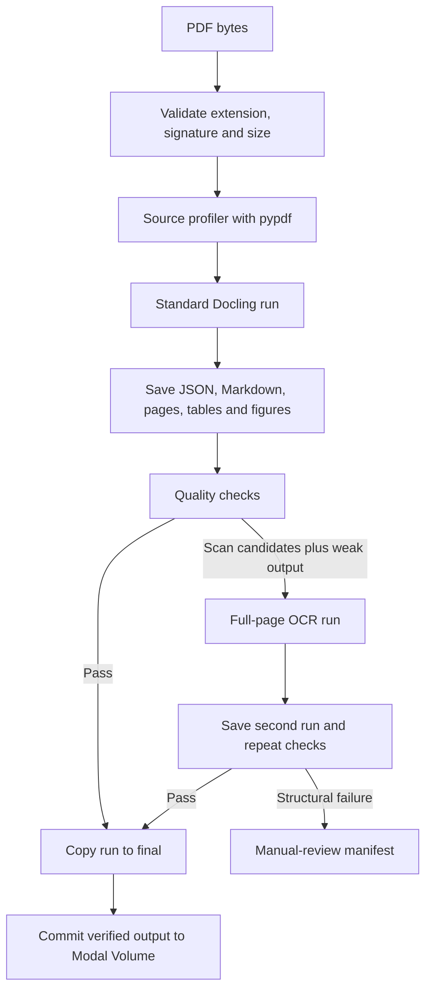

# Ingestion

The ingestion layer converts each source PDF into a verified, layout-aware evidence package.

Its purpose is not merely to extract text. It must preserve enough structure and provenance for later retrieval over prose, tables, figures, footnotes, rotated pages, and scanned appendices.

## Why Docling

A PDF is a collection of drawing instructions, not a semantic document.

A naive text extractor can read embedded characters but usually does not know that one region is a heading, another is a two-column paragraph, and another is a table or caption.

OCR alone has the opposite problem. It can recognize visible characters, but it may discard a high-quality native text layer and still flatten the layout.

Docling gives the prototype one document model containing:

- Ordered text and headings
- Document-item labels such as text, table, picture, and footnote
- Page provenance and bounding boxes
- Reconstructed table cells
- Page, table, and picture images
- Structured JSON and readable Markdown

This is why the system does not OCR every page by default.

Native PDF text is usually:

- Cleaner than OCR
- Faster to process
- Searchable exactly
- Less likely to introduce spelling and numeric errors

The standard run preserves native text and asks Docling to use OCR where needed. Full-page OCR is reserved for documents with scan candidates and evidence that the standard result is weak.

## Architecture



There is no VLM ingestion path in the prototype.

After the OCR retry, an unresolved structural failure is marked for manual review. The `needs_vlm` field is only a diagnostic recommendation retained in the manifest; it does not trigger another model.

## File responsibilities

### `docling_ingestion_service.py`

Runs inside Modal and owns:

- Docling configuration
- Standard and full-page OCR runs
- Source profiling
- Quality checks
- Output serialization
- Modal Volume storage
- Status and download functions

### `docling_ingestion_client.py`

Runs locally and:

- Validates the local PDF path
- Uploads PDF bytes to Modal
- Retrieves ingestion status
- Downloads verified output
- Safely extracts returned ZIP archives

### `run_ingestion.py`

Provides commands to:

- Submit one PDF
- Check a document’s status
- Download verified output

### `batch_ingestion.py`

Discovers a directory of PDFs and submits them concurrently.

Each document receives a stable ID derived from:

```text
normalized filename + first 12 characters of the SHA-256 content hash
```

## Source-page profiler

Before Docling runs, a small `pypdf` profiler records three facts for every page:

| Field | Purpose |
|---|---|
| Native text character count | Fewer than 40 stripped characters marks a scan candidate. |
| `/Rotate` value | Records PDF-declared rotation as 0, 90, 180, or 270 degrees. |
| Source page count | Establishes the expected Docling page and image count. |

The profiler does not parse tables or replace Docling.

It creates independent expectations used to determine whether the conversion output is plausible. This matters because a parser should not be the only judge of its own output.

## Docling configurations

Both runs use Docling’s standard PDF pipeline with:

```text
OCR enabled
table structure enabled
page images enabled
picture images enabled
table images enabled
image scale 2.0
```

The only conversion difference is:

| Run | `force_full_page_ocr` | Intended use |
|---|---:|---|
| Standard | `False` | Every document; preserve native text and OCR where needed. |
| OCR retry | `True` | Only when scan candidates coexist with weak standard output. |

The prototype retries the whole PDF instead of individual pages because the selected Docling converter is configured at document level.

A production refinement could submit page ranges or reconstruct a mixed document, but that would require additional page-merging logic.

## Saved output

Documents are stored in the `clinical-qa-ingestion-data` Modal Volume:

```text
/data/documents/{document_id}/
├── source/
│   └── original.pdf
├── runs/
│   ├── standard/
│   └── full_page_ocr/       # only when a retry occurred
├── final/                   # retrieval reads verified output
└── review/                  # only for manual-review cases
```

A completed run contains:

```text
document.json
document.md
source_metadata.json
quality_report.json
pages/page_001.png
tables/table_001.json
tables/table_001.csv
tables/table_001.md
tables/table_001.png
figures/figure_001.png
```

The final directory also contains `ingestion_manifest.json`, recording the document ID, status, selected run, and expected files.

## Why both JSON and Markdown

### `document.json`

This is the canonical machine-readable output.

It preserves:

- Docling item types
- Text labels
- Table cells
- Page provenance
- Bounding boxes
- Picture references
- Document structure

The evidence builder reads this file.

### `document.md`

This is the human-readable audit representation.

It is useful for checking whether:

- Headings are in the correct order
- Paragraph text is sensible
- OCR text is present
- Tables are readable
- Scanned appendices were extracted

It is not the only retrieval source.

### Separate assets

Table files make structured values inspectable without reading Docling’s internal JSON.

Page, table, and figure images preserve the visual source for audits and future visual verification.

## Quality checks

The checks are intentionally simple and deterministic:

| Check | How it works | Failure meaning |
|---|---|---|
| Required files | Verify `document.json` and `document.md` exist. | Conversion did not produce its basic contract. |
| JSON page parity | Compare JSON page count with the source page count. | Pages may have been dropped or duplicated. |
| Page-image parity | Compare saved page PNG count with the source. | Visual provenance is incomplete. |
| Table crop presence | Require a PNG beside every table JSON. | A structured table cannot be visually audited. |
| Docling low-grade signal | Read `result.confidence.low_grade`. | `POOR` or `FAIR` contributes to retry. |
| Text-volume sanity | Require approximately 100 Markdown characters per page. | The document may have produced too little content. |
| Scan evidence | Look for pages with fewer than 40 native characters. | Prevents unnecessary OCR retries. |

The standard run requests full-page OCR only when:

```text
the run is not already full-page OCR
AND at least one source page is a scan candidate
AND (
    Docling low grade is POOR or FAIR
    OR Markdown output is unusually small
)
```

A run passes when it has no structural issue and does not still require an OCR retry.

After full-page OCR, unresolved structural issues produce `manual_review` rather than a guessed retrieval package.

## Observed corpus result

The batch report records:

| Metric | Result |
|---|---:|
| PDFs submitted | 50 |
| Passed | 50 |
| Manual review | 0 |
| Remote errors | 0 |
| Standard pipeline selected | 50 |

This demonstrates that all documents satisfied the implemented checks.

It does not mean OCR and table interpretation are perfect. Later evaluation showed that figure OCR could recognize numbers and years while losing the relationship between them.

That is a visual-structure limitation not detected by page-count or token-confidence checks.

## Running ingestion

Deploy the Modal service:

```bash
modal deploy ingestion/docling_ingestion_service.py
```

Submit one PDF:

```bash
python3 ingestion/run_ingestion.py submit Medical_PDF/00_short_bowel_syndrome.pdf
```

Submit the complete directory:

```bash
python3 ingestion/batch_ingestion.py Medical_PDF --max-containers 5
```

The function’s deployed `max_containers` setting remains the final concurrency cap even if the local batch requests more workers.

## Known limitations

1. The checks validate completeness signals, not medical correctness.
2. Native-text count is a useful scan heuristic but can flag sparse pages.
3. PDF rotation is recorded, but reading order is not separately scored.
4. Table crop presence proves an image exists, not that cell reconstruction is correct.
5. Docling and OCR confidence are not calibrated probabilities of correct extraction.
6. Full-page OCR is document-level in the current implementation.
7. Figure value-to-label relationships require more than linear OCR.


These limits are carried into retrieval through provenance, extraction-quality weights, visual-review flags, confidence caps, and abstention rules.