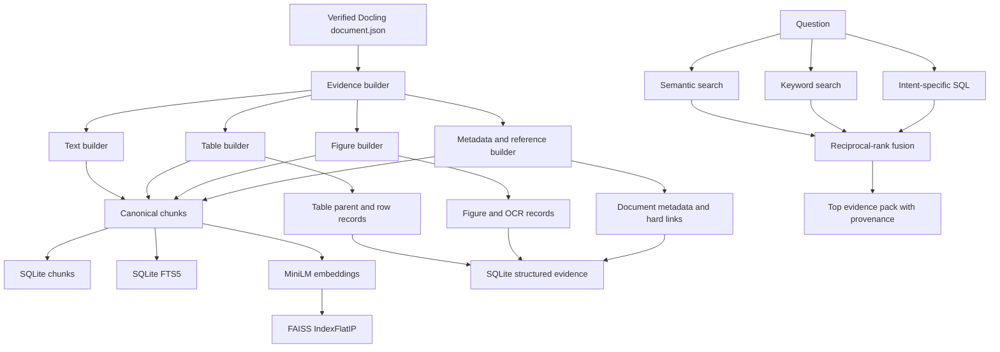

# Retrieval and Evidence Builder

The retrieval layer turns verified Docling documents into a canonical evidence base and provides hybrid search over prose, exact terms, structured tables, figures, metadata, and explicit cross-document links.

It is best described as **hybrid RAG with structured relations**.

It is not a full knowledge graph. The system stores only relations explicitly stated by the corpus, while semantic and keyword search discover softer conceptual similarity at query time.

## Why ingestion determines retrieval design

Docling does more than emit Markdown. Its JSON identifies:

- Text items and headings
- Tables and cells
- Pictures
- Page provenance
- Bounding boxes
- Source references

Flattening that output into one vector store would discard information specifically tested by the assignment:

- Exact codes require lexical or structured lookup.
- Dose tables require header-to-cell relationships.
- Figures require captions, nearby text, OCR, and visual-risk flags.
- Scanned appendices may appear as OCR text or reconstructed tables.
- Registry instructions require source-to-target traversal.
- Citations require page and Docling-item provenance.

The evidence builder therefore normalizes every source type into a common `EvidenceChunk` while retaining source-specific records in SQLite.

## Architecture



## Canonical evidence record

Every searchable chunk contains:

| Field | Meaning |
|---|---|
| `chunk_id` | Stable evidence identifier used by FAISS, SQLite, the agent, and citations. |
| `document_id` | Stable source document identifier. |
| `content_type` | Text, footnote, table, table window, figure, or reference. |
| `title` and `section` | Document and nearest section context. |
| `search_text` | Contextualized text embedded and indexed by FTS5. |
| `display_text` | Evidence shown to the agent and used in citations. |
| `page_numbers` | Source PDF pages. |
| `source_refs` | Docling JSON references such as `#/texts/5`. |
| `parent_id` | Parent table or figure identifier. |
| `asset_path` | Optional table or figure image. |
| `ingestion_quality` | Quality label propagated from ingestion when available. |
| `metadata` | Headers, window bounds, OCR confidence, target documents, and flags. |

The same evidence ID is used across:

```text
canonical chunk
FAISS vector mapping
retrieval registry
agent claim
final citation
```

This avoids reconstructing citations using fuzzy text matching.

## Text chunking

Prose uses Docling’s `HybridChunker` with the tokenizer belonging to:

```text
sentence-transformers/all-MiniLM-L6-v2
```

Configuration:

```text
maximum tokens: 256
merge peer items: enabled
repeat table header: enabled
excluded from prose:
    tables
    pictures
    charts
    page headers
    page footers
```

This is not naive fixed-character splitting.

The chunker uses Docling structure, retains headings, and contextualizes each chunk with its document and section:

```text
Document: Short Bowel Syndrome
Section: What causes Short Bowel Syndrome?
<chunk text>
```

### Why 256 tokens

The monographs are organized into short clinical sections. A 256-token limit creates focused retrieval units while leaving enough room for a definition, list, or short explanation.

Larger chunks can mix adjacent topics and reduce retrieval precision. Smaller chunks can separate statements from their headings and qualifiers.

A separate semantic boundary detector was not used because Docling already supplies structural boundaries. Adding another model would increase complexity and nondeterminism without improving tables or figures.

## Table evidence

Every Docling table is reconstructed into a matrix using cell row and column offsets.

Header cells are selected from Docling’s `column_header` markers, with fallbacks and unique names for duplicate or blank headers.

Tables are represented at three levels:

1. **Table parent record**
2. **Structured table rows**
3. **Searchable table chunks**

### Table parent

Stores:

- Table title
- Headers
- Row and column count
- Markdown representation
- Page numbers
- Source reference
- Image path
- Visual-review flag

### Structured rows

Each row becomes a JSON dictionary:

```json
{
  "Phase": "Induction",
  "Dose": "150 mg"
}
```

Rows also receive searchable text:

```text
Phase: Induction | Dose: 150 mg
```

This allows deterministic lookup without relying on embedding similarity.

### Small versus large tables

A table becomes one searchable chunk only when:

```text
data rows <= 12
AND contextualized table text <= 220 tokens
```

Larger tables receive:

- One `table_parent` summary
- Six-row `table_window` chunks
- One-row overlap between windows
- Repeated headers in every window
- Separate structured records for every row

The overlap prevents a value near a window boundary from losing context.

Rows with a blank first cell but populated later cells are marked `requires_visual_check`, because a merged label may have been lost.

## Figure evidence

Figures are processed offline during evidence building. The assistant does not run OCR for every question.

For every Docling `PictureItem`, the builder:

1. Finds `figures/figure_NNN.png`.
2. Verifies that the image is readable.
3. Collects its caption, section, nearby text, pages, and source reference.
4. Checks whether it is a duplicate visual representation of a table.
5. Runs Tesseract OCR when it remains an independent figure.
6. Stores OCR tokens, confidence, numeric tokens, and visual-review status.

OCR preprocessing:

```text
convert to grayscale
increase contrast
resize 2×
run Tesseract with PSM 11
```

Tokens below confidence 30 are excluded.

Figure OCR passes the prototype check when:

```text
meaningful OCR text exists
AND median accepted-token confidence >= 50
```

### Preventing table/figure duplication

A picture is merged into a table record when either:

- Its bounding box overlaps a table region by at least 65%.
- At least 55% of the smaller token set overlaps between figure OCR and structured table Markdown on the same page.

Otherwise, a meaningful caption or OCR result becomes a figure chunk. Decorative pictures without useful text or captions are rejected.

The current build contains 13 figure records, and all 13 passed the token-level OCR threshold.

However, evaluation abstained on four exact figure-value questions because linear OCR did not preserve which value belonged to the 2024 plotted point.

Recognizing tokens is not the same as understanding their spatial relationships.

## Explicit document links

The corpus contains ordinary registry codes in headers and control records as well as genuine instructions to consult another monograph.

Treating every registry-code mention as an edge originally indexed 481 noisy reference chunks.

A code mention now becomes a hard link only when:

1. It is not in a page header, footer, or title.
2. It is not routine registry metadata.
3. The target registry differs from the source registry.
4. The sentence contains explicit linking language.

Supported linking language includes:

```text
consult
refer to
see the monograph
use values from
found in
available in
```

Valid links are deduplicated using:

```text
target registry
target section
entity
requested field
```

The target registry is resolved against the `documents` table to produce a target document ID.

The corrected build contains 50 explicit references, and all 50 resolve to a target document.

Soft relationships—such as adult and childhood versions of the same condition—are not hard-coded. They are found using semantic and keyword retrieval.

## Storage layout

The build creates:

```text
/data/retrieval/current/
├── retrieval.sqlite
├── chunks.faiss
├── vector_mapping.json
├── chunks.jsonl
├── figure_audit.json
└── build_manifest.json
```

## `retrieval.sqlite`

SQLite is the canonical evidence and exact-lookup database.

| Table | Stored information |
|---|---|
| `documents` | Title, registry code, population, page count, quality, and source paths. |
| `chunks` | Canonical searchable evidence and provenance. |
| `table_records` | Table headers, dimensions, Markdown, pages, and image path. |
| `table_rows` | Exact row dictionaries and searchable `header: value` text. |
| `figures` | Caption, nearby text, OCR, pages, image, and visual-review state. |
| `document_references` | Source instruction, target code, target document, page, and section. |
| `chunks_fts` | FTS5 keyword-search table. |

SQLite is appropriate because the corpus is fixed, small, read-heavy, and deployed as one immutable artifact.

It provides deterministic joins and aggregations without another server. PostgreSQL is used separately for mutable chat memory.

## `chunks.faiss`

Every chunk’s `search_text` is embedded using `all-MiniLM-L6-v2`.

Vectors are normalized and stored in:

```text
IndexFlatIP wrapped by IndexIDMap2
```

For normalized vectors, inner product is equivalent to cosine similarity.

The model produces 384-dimensional vectors.

It was selected because it is:

- Small
- Fast on CPU
- Reproducible
- Appropriate for a 972-chunk English corpus

It is a general-purpose model rather than a clinically fine-tuned model. Exact codes and doses are therefore never delegated to semantic search alone.

## `vector_mapping.json`

FAISS stores numeric vector IDs.

This file maps every vector ID to:

- `chunk_id`
- `document_id`
- `content_type`

It also records:

- Embedding model
- Dimension
- Similarity metric
- Vector count

## `chunks.jsonl`

This is a human-readable, lossless audit copy of all canonical chunks.

It is not another retrieval database.

It allows inspection of:

- Embedded text
- Evidence types
- Pages
- References
- Metadata
- Parent relationships

## Audit files

`figure_audit.json` records whether each picture was:

- Indexed as a figure
- Merged into a table
- Rejected

It also records asset and OCR status.

`build_manifest.json` records configuration, artifact names, counts, and processing errors.

## Query-time hybrid retrieval

The controller always runs:

- Semantic search over FAISS
- Keyword search over FTS5

It conditionally adds:

- Metadata lookup
- Footnote lookup
- Structured table rows
- Figure lookup
- Document-reference lookup
- Target-document lookup
- Corpus aggregation

Results are registered by evidence ID.

Each retrieval channel contributes:

```text
RRF contribution = 1 / (60 + rank)
```

Exact evidence receives a small priority bonus.

Raw semantic similarity and keyword scores are retained for diagnostics, while rank drives fusion because the raw scores are not directly comparable.

## Citation mechanism

Citations are built from stored provenance:

```text
Docling item
    ↓
page number + source reference
    ↓
EvidenceChunk
    ↓
SQLite row or structured evidence
    ↓
EvidenceItem with stable evidence_id
    ↓
agent claim cites evidence_id
    ↓
deterministic validator checks evidence_id
    ↓
frontend Citation object
```

A citation includes:

- Evidence ID
- Document title
- Page numbers
- Section
- Content type
- Docling source references
- Bounded excerpt
- Optional asset path

The model cannot create a usable fake citation because unknown evidence IDs fail validation.

A cross-document answer must contain:

1. A citation to the source instruction identifying the target.
2. A citation to target-document evidence containing the requested value.

Corpus aggregations store source members so the contributing documents and pages remain available.

## Building the knowledge base

Deploy the Modal evidence builder:

```bash
modal deploy retrieval/modal_server.py
```

Trigger the build:

```bash
python3 retrieval/build_knowledge_base.py
```

The build replaces `/data/retrieval/current`, writes the new artifacts, commits the Modal Volume, and returns the manifest.

## Current metrics

```text
documents: 50
chunks: 972
text/footnote chunks: 788
table chunks: 121
figure chunks: 13
reference chunks: 50
tables: 111
structured table rows: 362
resolved references: 50 / 50
processing errors: 0
```

## Known limitations

1. MiniLM can confuse related diseases or populations.
2. The 256-token policy may split long dependencies across chunks.
3. OCR token confidence does not preserve chart geometry.
4. Tables parsed as prose may lose row and column semantics.
5. Hard-link parsing intentionally misses implicit references without linking language.
6. FTS5 does not understand synonyms; semantic retrieval provides that complementary behavior.
7. Extraction-quality values are heuristic type-based weights.
8. A larger or changing corpus would need incremental indexing and a server-based vector store.